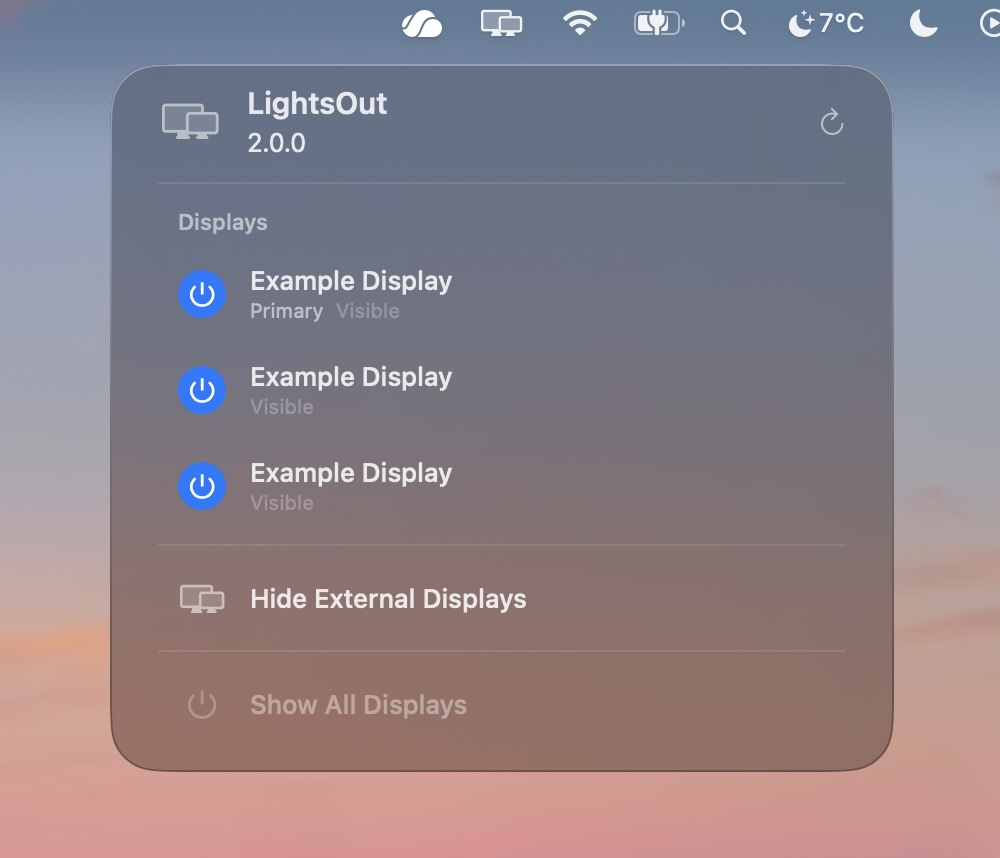

# lights-out

Forever free menubar utility to show or hide any display with a simple button press. No more fiddling around with cables or bloated apps!

I've only tested in Tahoe v26. It may work in older versions of MacOS, but I've not personally verified this, so use at your own risk :)

## Features

- Instantly hide displays in software. Particularly handy if you've got multiple devices connected to the same display(s)!
- macOS automatically moves application windows to visible displays when a screen is hidden.
- Protects against accidentally hiding all displays.
- Shows all displays again on application exit, as a safety measure.
- Optionally runs at login.
- Tahoe-friendly glass theme

## Credits

Forked from [LightsOut](https://github.com/AlonX2/LightsOut) by AlonX2.

## Screenshot

